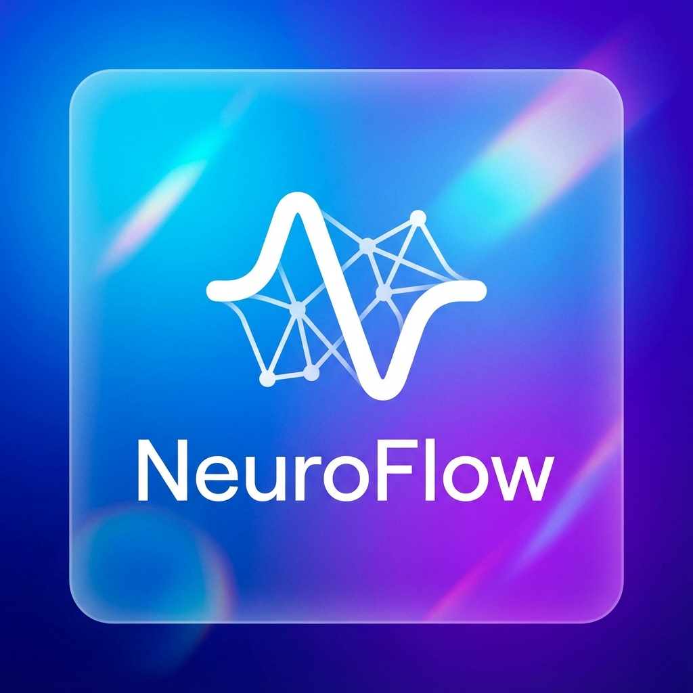

<p align="center">
  
</p>

# 🧠 NeuroFlow: The AI-Architected Training Platform

NeuroFlow is a state-of-the-art node-based platform designed to simplify the creation, management, and deployment of AI training pipelines. By combining the power of **AutoTrain Advanced**, a robust **React-Flow** frontend, and **Gemini-powered AI Architecture**, NeuroFlow enables users to build production-ready AI workflows in minutes.

---

## 🚀 Vision
The goal of NeuroFlow is to democratize fine-tuning and AI orchestration. Whether you are a researcher or an engineer, you can design complex pipelines—from data ingestion to model deployment—using a visual canvas aided by an AI co-pilot.

<p align="center">
  
</p>

---

## ✨ Key Features

### 🤖 AI Build (NeuroBot Architect)
*   **Intelligent Design**: Describe your goal in natural language (e.g., *"Build a LLM fine-tuning pipeline for medical data"*), and NeuroBot will automatically architect the entire node graph for you.
*   **Dual-Mode Assistant**: Supports both general architectural advice and direct graph generation.
*   **Powered by Gemini**: Leverages high-performance LLMs to ensure logically sound connections.

### 🎨 Visual Workflow Editor
*   **Reactive Canvas**: Drag-and-drop nodes to build sequences of datasets, models, trainers, and logic routers.
*   **Node Library**:
    *   **Data**: Hub and local dataset support.
    *   **Logic**: Routers, Python REPL, and conditional switches.
    *   **Interface**: One-click deployment to **Streamlit** and **Gradio**.
    *   **Deployment**: Direct push-to-hub integration.

### ⚙️ Production-Ready Engine
*   **AutoTrain Integration**: Deeply integrated with `autotrain-advanced` for high-performance training on local or cloud backends.
*   **Dynamic UI Generation**: Automatically generates and launches interactive web interfaces (Streamlit/Gradio) tailored to your pipeline's inputs and outputs.
*   **Local Persistence**: Graphs are automatically saved to your browser's local storage.
*   **Pipeline Export**: Download your architectures as JSON for sharing or version control.

  <p align="center">
  
</p>

---

## 🏗️ Technical Architecture

### **Frontend**: React + Vite
*   **Core**: TypeScript-based SPA.
*   **Graph Engine**: [React Flow](https://reactflow.dev/) for high-performance node orchestration.
*   **Styling**: Premium UI design with dark mode, glassmorphism, and smooth animations.

### **Backend**: Python (AutoTrain)
*   **API Layer**: FastAPI/Uvicorn for low-latency communication.
*   **Execution Engine**: `GraphExecutor` handles topological sorting and sequential/parallel execution of nodes.
*   **Subprocess Orchestration**: Manages orphan UI processes (Streamlit/Gradio) with automated port management and logging.

### **AI Core**: Gemini API
*   **Integration**: Official `@google/genai` SDK for structured JSON generation of graph states.

---

## 🛠️ Setup and Installation

### Prerequisites
*   **Node.js** (v18 or higher)
*   **Python** (3.10 or higher)
*   **Gemini API Key** (from [Google AI Studio](https://aistudio.google.com/))

### 1. Clone the Repository
```bash
git clone https://github.com/Esmail-ibraheem/NeuroFlow.git
cd NeuroFlow
```

### 2. Backend Setup
```bash
# Install dependencies
pip install -e .
pip install streamlit gradio uvicorn fastapi
```

### 3. Frontend Setup
```bash
cd neuroflow
npm install
```

### 4. Configuration
Create a `.env` file in the `neuroflow` directory:
```env
VITE_API_KEY=your_gemini_api_key_here
```

---

## 🚀 Running the Application

### Start the Backend (API)
From the root directory:
```bash
cd src
uvicorn autotrain.app.app:app --reload
```

### Start the Frontend
From the `neuroflow` directory:
```bash
npm run dev
```

The app will be available at `http://localhost:5173`.

---

## 🧪 Testing and Verification

### Manual Verification
1.  **AI Build**: Click the "AI Build" button and type *"Fine-tune Llama 3 on a medical dataset"*.
2.  **Save/Load**: Create a graph, refresh the page, and verify the graph persists.
3.  **UI Launch**: Add a "Streamlit UI" node, connect it to a model output, and click "Train". A new browser tab will open with the generated interface.

### Automated Diagnostics
A diagnostic script is provided to verify your Gemini model access:
```bash
cd neuroflow
node list_models.js
```

---

## 📁 Repository Structure
```text
.
├── src/                # Backend Source (Python)
│   └── autotrain/      # AutoTrain Core & Graph Engine
├── neuroflow/          # Frontend Source (React/Vite)
│   ├── src/            # UI Components & Services
│   └── .env            # API Keys
├── configs/            # Training Configurations
└── README.md           # This file!
```

---

## 📜 License
Developed as part of the NeuroTron project. MIT.

